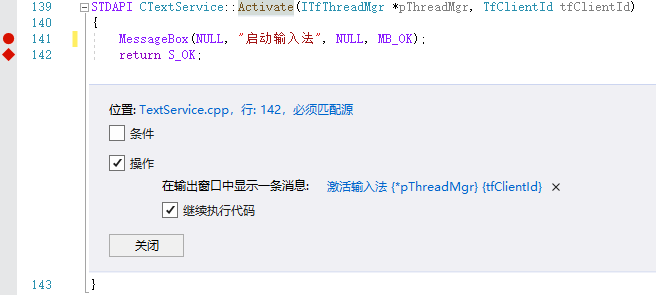

## 2.1.0 主要文件结构

- DllMain.cpp
- Server.cpp
  - Register.cpp
- TextService.cpp

DllMain.cpp是DLL的入口，在整个解决方案中，几乎没有变化。

Server.cpp是COM组件的框架，在整个解决方案中，只是随着功能的添加，稍微有变化。

TextService.cpp是TextService的核心类，在整个解决方案中，会不断添加该分支下的文件。

## 2.1.1 COM组件的导出函数

导出函数在整个解决方案中，没有任何变化。相应的类厂对象和DLL的引用计数，在整个解决方案中，也没有任何变化。

函数					|说明
--------			|-----
DllGetClassObject	|获取COM组件对象
DllCanUnloadNow		|查询能否注销COM组件
DllRegisterServer	|注册COM组件
DllUnregisterServer	|注销COM组件

## 2.1.2 注册TSF输入法

在编译好的TSF输入法dll文件目录，以管理员身份启动CMD控制台，注册输入法。
```
regsvr32.exe 1BasicTextService.dll
```
regsvr32.exe会调用DllRegisterServer导出函数。之间还经历了COM库的一系列调用堆栈。请视为运行命令后，DllRegisterServer会被调用。
编写自己的注册程序时，同样要使用COM库，然后调用DllRegisterServer导出函数。在之后讲解编写自定义安装程序的时候，再详细解说这部分。

与IME输入法要安装到系统目录不同，TSF输入法被要求安装到程序所在的Program Files文件夹中。实际情况还要复杂，因为TSF输入法作为COM组件，其权限受第一个启动ta的程序权限影响。
例如输入法如果在浏览器中第一次被加载，那么输入法就不具备写权限。

大致有两种解决方案，从第四章开始介绍。

注册TSF输入法主要分为三步
- 注册COM组件
- 注册Text Input Processor
- 注册TSF类别（这部分当前工程未涉及）

## 2.1.3 调试TSF输入法的注册过程

以管理员身份运行Visual Studio，可以调试输入法的注册过程。
在项目属性中，如图设置。


如果要调试32位版本的注册过程，相应设置为32位regsvr32.exe。

>$(SystemRoot)\syswow64\regsvr32.exe

## 2.1.4 注册COM组件

FSF框架由TSF管理器和应用程序，以及文本服务组成。文本服务，在篇文章中特指输入法。输入法在TSF框架中实现为COM服务器。
所以注册输入法的第一步，是要把输入法注册为一个COM组件。

因为输入法是进程内组件，所以要分别注册64位和32位版本。
64位版的COM组件，注册到注册表的以下键中；

>HKEY_CLASSES_ROOT\CLSID\{CLSID}

32位版的要注册到以下键中，使用regsvr32.exe注册，regsvr32.exe会自动完成。

>HKEY_CLASSES_ROOT\WOW6432Node\CLSID\{CLSID}

## 2.1.5 注册Text Input Processor

ITfInputProcessorProfiles接口由系统实现，用于注册Text Input Processor。
其中ITfInputProcessorProfiles::Register(c_clsidTextService)方法，将c_clsidTextService注册为文本服务，本文特指输入法。

```C++
hr = pInputProcessProfiles->Register(c_clsidTextService);

if (hr != S_OK)
	goto Exit;

cchA = GetModuleFileNameA(g_hInst, achFileNameA, ARRAYSIZE(achFileNameA));
cchIconFile = MultiByteToWideChar(CP_ACP, 0, achFileNameA, cchA, achIconFile, ARRAYSIZE(achIconFile)-1);
achIconFile[cchIconFile] = '\0';

hr = pInputProcessProfiles->AddLanguageProfile(c_clsidTextService,
						TEXTSERVICE_LANGID, 
						c_guidProfile, 
						TEXTSERVICE_DESC, 
						(ULONG)wcslen(TEXTSERVICE_DESC),
						achIconFile,
						cchIconFile,
						TEXTSERVICE_ICON_INDEX);
```

ITfInputProcessorProfiles::AddLanguageProfile()配置输入法的基本属性。

当前项目不包含注册TSF类别。

至此，当前项目注册完毕。用户可以设置断点，观察详细注册过程。

## 2.1.6 输入法的启动

此时，想要调试输入法的启动过程，会发现跟踪不到输入法被激活。这是因为当前输入法被注册为了美国英语。

将globals.h中的宏TEXTSERVICE_LANGID修改为简体中文

```C++
//#define TEXTSERVICE_LANGID	MAKELANGID(LANG_ENGLISH, SUBLANG_ENGLISH_US)
#define TEXTSERVICE_LANGID	MAKELANGID(LANG_CHINESE, SUBLANG_CHINESE_SIMPLIFIED)
```

在TextService.cpp文件中添加断点



就可以跟踪到输入法被激活时的演示效果。


>**最好在虚拟机中调试输入法，否则很容易将系统搞崩溃。**


## 2.1.7 ITfTextInputProcessor

调用ITfInputProcessorProfiles接口将输入法注册为文本服务后，TSF管理器会激活注册为当前语言的所有文本服务。

也就是调用由输入法实现的ITfTextInputProcessor文本输入处理器。

在Activate(ITfThreadMgr *pThreadMgr, TfClientId tfClientId)方法中，主要完成三件任务。

1. 保存ITfThreadMgr线程管理器对象
2. 保存ITfClientId客户端标识符对象
3. 安装输入法的事件接收器

输入法会在所有接收文本服务的进程中被激活，这是调试输入法的难点之一。在下一节中，将介绍调试输入法的另外一个难点：跟踪焦点。
