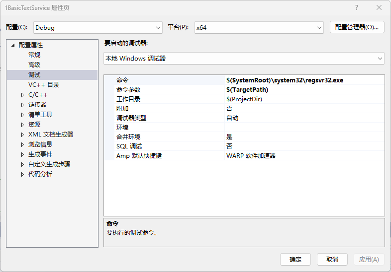

## 2.1.0 文件结构

- DllMain.cpp
- Server.cpp
  - Register.cpp
- TextService.cpp

DllMain.cpp是DLL的入口，在整个解决方案中，几乎没有变化。

Server.cpp是COM组件的框架，在整个解决方案中，只随功能的添加，稍微有变化。

TextService.cpp是TextService的核心类，在工程中，会不断添加该分支下的文件。

## 2.1.1 COM组件的导出函数

函数					|说明
--------			|-----
DllGetClassObject	|获取COM组件对象
DllCanUnloadNow		|查询能否注销COM组件
DllRegisterServer	|注册COM组件
DllUnregisterServer	|注销COM组件

## 2.1.2 注册TSF输入法

在编译好的TSF输入法dll文件目录，以管理员身份启动CMD控制台，注册输入法。
```
regsvr32.exe XXX.dll
```
regsvr32.exe会调用DllRegisterServer导出函数。之间还经历了COM库的一系列调用堆栈。我无法表述清楚，请视为运行命令后，DllRegisterServer会被调用。
编写自己的注册程序，同样要使用COM库，然后调用DllRegisterServer导出函数。在之后讲解编写自定义安装程序的时候，再详细讲解这部分。

与IME输入法要安装到系统目录不同，TSF输入法被要求安装到程序所在的Program Files文件夹中。实际情况还要复杂，因为TSF输入法作为COM组件，其权限受第一个启动ta的程序权限影响。
例如输入法如果在浏览器中第一次被加载，那么输入法就不具备写权限。

大致有两种解决方案，目前我都还不会，到时再讲。

## 2.1.3 调试TSF输入法注册过程


