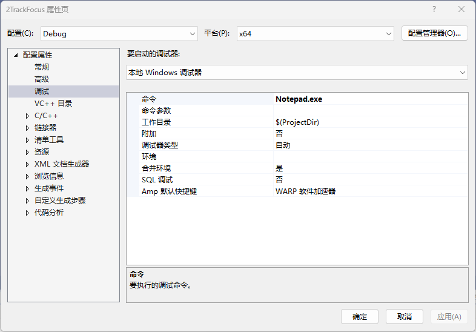
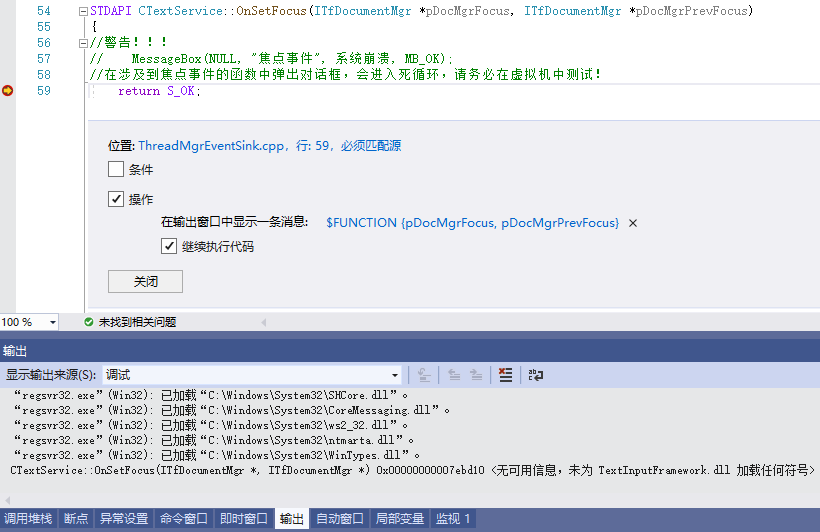
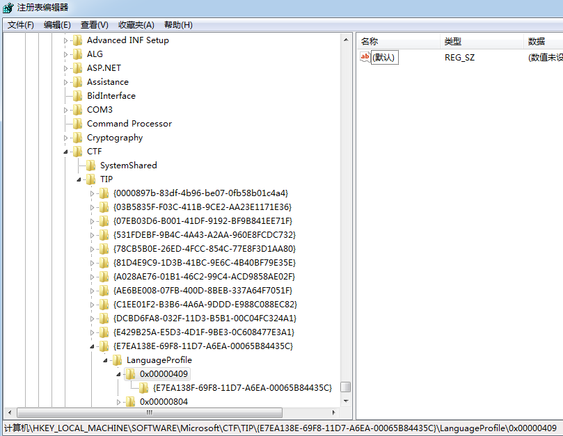

## 2.2.0 主要文件结构

- Server.cpp
- TextService.cpp
  - ThreadMgrEventSink.cpp

ITfTextInputProcessor文本输入处理器的实现在TextService.cpp文件中。

ThreadMgrEventSink线程管理器事件接收器的实现在ThreadMgrEventSink.cpp文件中。

将ITfTextInputProcessor和ThreadMgrEventSink这样的相关接口，实现在同一个类中，可以保持很好的结构关系。

## 2.2.1 TSF输入法中组件、接口的含义

同一个DLL文件或EXE文件，可以包含多个组件。一个组件可以包含多个接口。一个接口可以包含多个成员函数。

而且，同一个DLL文件或EXE文件，可以只包含一个组件。一个组件也可以只包含一个接口。一个接口也可以只有一个成员函数。

例如，微软拼音就在一个DLL文件中包含了多个组件，每个组件对应不同版本的输入法。

TSF输入法的接口类似于IME输入法的导出函数。输入法需要实现的内容，都是通过接口提供给TSF管理器的。
但是TSF输入法因为是COM组件的原因，系统并不知道TSF输入法所实现的接口，甚至并不知道这个COM组件是个输入法。

输入法调用了上一节介绍的ITfInputProcessorProfiles文本服务语言配置操作，系统才知道这个COM组件是个文本服务。
所以系统在每一个需要文本服务的进程中，调用了输入法的ITfTextInputProcessor文本输入处理器。

这表明，输入法必须通过某种方式告诉系统，自己实现了哪些接口，系统才会调用输入法提供的相应接口。
一共有两种方式实现这种“通告”。一种是像ITfInputProcessorProfiles那样，将组件类别写入到注册表中，在后面的小节会讲到如何注册组件类别。

另一种就是本节介绍的：安装事件接收器。

## 2.2.2 输入法与TSF管理器之间的关系

[这是微软拼音开发团队的博客](https://blog.csdn.net/MSPinyin?type=blog)


输入法调用ITfInputProcessorProfiles接口，注册为文本服务。
相应的，TSF管理器会根据注册表中的注册信息，创建文本服务对象，激活输入法。

TSF管理器会调用DllGetClassObject导出函数。然后通过类厂对象，得到输入法对象。

然后调用ITfTextInputProcessor::Activate(ITfThreadMgr *pThreadMgr, TfClientId tfClientId)方法。

输入法保存ITfThreadMgr线程管理器和TfClientId客户端标识符对象，开始初始化输入法。

## 2.2.3 安装事件接收器

输入法保存ITfThreadMgr线程管理器的第一个目的是：安装输入法的事件接收器。

```C++
BOOL CTextService::_InitThreadMgrEventSink()
{
    ITfSource *pSource;
    BOOL fRet;

    if (_pThreadMgr->QueryInterface(IID_ITfSource, (void **)&pSource) != S_OK)
        return FALSE;

    fRet = FALSE;

    if (pSource->AdviseSink(IID_ITfThreadMgrEventSink, (ITfThreadMgrEventSink *)this, &_dwThreadMgrEventSinkCookie) != S_OK)
    {
        // Don't try to Unadvise _dwThreadMgrEventSinkCookie later
        _dwThreadMgrEventSinkCookie = TF_INVALID_COOKIE;
        goto Exit;
    }

    fRet = TRUE;

Exit:
    pSource->Release();
    return fRet;
}
```
输入法调用ITfThreadMgr::QueryInterface()方法，得到ITfSource消息接收器。

然后调用pSource->AdviseSink(IID_ITfThreadMgrEventSink, (ITfThreadMgrEventSink *)this, &_dwThreadMgrEventSinkCookie)方法，将ITfThreadMgrEventSink线程管理事件接收器，安装到消息接收器中。

TSF管理器会保存输入法传递的参数(ITfThreadMgrEventSink *)this，并调用输入法的QueryInterface()方法，查询输入法安装的事件接收器接口。
（看似这个回调过程，是冗余的，但好像这是安装事件接收器的标准过程。还没学到COM的这部分）

根据查询结果，当发生相应事件，TSF管理器就可以将输入法安装的事件，调用输入法的相应接口了。

安装ITfThreadMgrEventSink接口的最主要目的就是跟踪焦点事件。

在下一节中将介绍安装ITfTextEditSink编辑会话完成消息接收器。
本文的消息接收器和事件接收器，大体沿用了Windows对消息和事件的定义，就是接收由系统触发的消息和接收由用户触发的事件。

## 2.2.4 调试输入法

将当前工程设置为启动工程，按照上一节介绍的注册方法，先注册当前工程输入法。

然后将工程属性如下图设置，就可以调试输入法了。



安装ITfThreadMgrEventSink线程管理事件接收器后，就可以捕捉到焦点事件了。



在任何涉及到焦点事件的函数中，尽量使用跟踪。使用中断会进入重复循环。

## 2.2.5 虚拟机

除了容易将系统搞崩溃，需要在虚拟机中调试输入法外，也需要观察不同系统中，输入法的运行行为。



例如，在win7中就不需要先注销美国英语版本，而是可以直接注册简体中文版本，输入法可以分别运行在两个语言环境中。