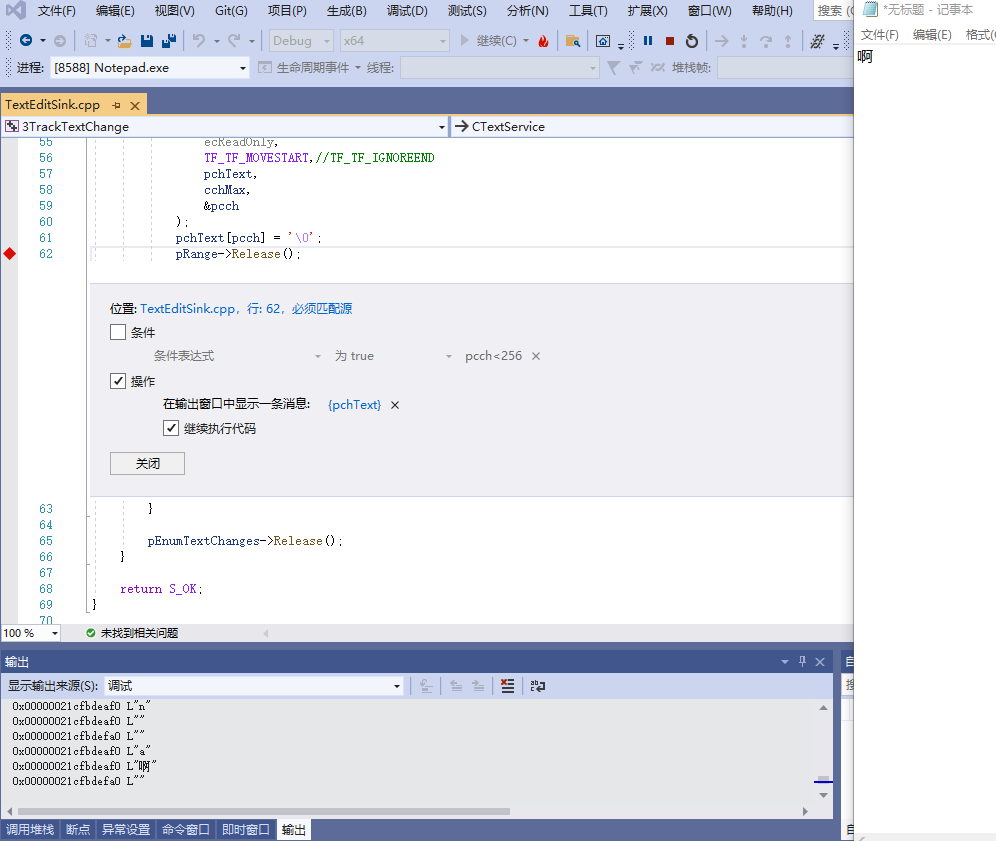

## 2.3.0 主要文件结构

- TextService.cpp
  - ThreadMgrEventSink.cpp
  - ITfTextEditSink

ThreadMgrEventSink线程管理器事件接收器的实现在ThreadMgrEventSink.cpp文件中。

ITfTextEditSink编辑会话完成消息接收器的实现在ITfTextEditSink.cpp文件中。

本节介绍ThreadMgrEventSink和ITfTextEditSink接口，如何初始化编辑环境和编辑完成时被TSF管理器回调。

## 2.3.1 安装ITfTextEditSink编辑会话完成消息接收器

在输入法被激活时，首先安装上节介绍的ThreadMgrEventSink线程管理事件接收器。
然后安装本节介绍的ITfTextEditSink编辑会话完成消息接收器。

首先得到具有输入焦点的文档管理器。

```C++
ITfDocumentMgr *pDocMgrFocus;
if ((_pThreadMgr->GetFocus(&pDocMgrFocus) == S_OK) &&
	(pDocMgrFocus != NULL))
{
	_InitTextEditSink(pDocMgrFocus);
	pDocMgrFocus->Release();
}
```

然后得到上下文堆栈顶部的上下文。

```C++
if (pDocMgr->GetTop(&_pTextEditSinkContext) != S_OK)
	return FALSE;
```

在上下文中安装编辑会话完成消息接收器。

```C++
if (_pTextEditSinkContext->QueryInterface(IID_ITfSource, (void **)&pSource) == S_OK)
{
	if (pSource->AdviseSink(IID_ITfTextEditSink, (ITfTextEditSink *)this, &_dwTextEditSinkCookie) == S_OK)
	{
		fRet = TRUE;
	}
	else
	{
		_dwTextEditSinkCookie = TF_INVALID_COOKIE;
	}
	pSource->Release();
}
```

现在，每当上下文发生变化，TSF管理器都会调用ITfTextEditSink编辑会话完成消息接收器。

## 2.3.2 处理输入焦点事件

在本解决方案所有工程中，当输入焦点发生变化时，都需要重新安装ITfTextEditSink编辑会话完成消息接收器。

首先卸载任何已安装的编辑会话完成消息接收器。

```C++
if (_dwTextEditSinkCookie != TF_INVALID_COOKIE)
{
	if (_pTextEditSinkContext->QueryInterface(IID_ITfSource, (void **)&pSource) == S_OK)
	{
		pSource->UnadviseSink(_dwTextEditSinkCookie);
		pSource->Release();
	}

	_pTextEditSinkContext->Release();
	_pTextEditSinkContext = NULL;
	_dwTextEditSinkCookie = TF_INVALID_COOKIE;
}
```

然后重新获取上下文。

```C++
if (pDocMgr->GetTop(&_pTextEditSinkContext) != S_OK)
	return FALSE;
```

最后将ITfTextEditSink编辑会话完成消息接收器，安装到新的上下文中。

## 2.3.3 处理编辑会话完成消息

当写访问文档锁被释放时，TSF管理器调用ITfTextEditSink编辑会话完成消息接收器。
输入法属于文本服务，文本服务包括语音输入、键盘输入等所有编辑文本服务。本接口的应用场景是，编辑内容是由其他文本服务修改的情况。

ITfTextEditSink编辑会话完成消息接收器，可以感知编辑会话更改的内容。

ITfEditRecord编辑记录的GetSelectionStatus方法用于检测选定内容是否已更改或插入符号是否已移动。

```C++
if (pEditRecord->GetSelectionStatus(&fSelectionChanged) == S_OK &&
	fSelectionChanged)
{
}
```

GetTextAndPropertyUpdates返回一个指向IEnumTfRanges文本范围枚举器的指针，指向一个ITfRange文本范围对象的集合。

```C++
if (pEditRecord->GetTextAndPropertyUpdates(TF_GTP_INCL_TEXT, NULL, 0, &pEnumTextChanges) == S_OK)
{
	if (pEnumTextChanges->Next(1, &pRange, NULL) == S_OK)
	{
		//
		// pRange is the updated range.
		//

		pRange->Release();
	}

	pEnumTextChanges->Release();
}
```

>ITfContext上下文和ITfRange文本范围，是输入法的核心接口，在后面小节会继续介绍。

## 2.3.4 监听用户输入

如图设置跟踪，可以查看用户输入的编辑内容。

