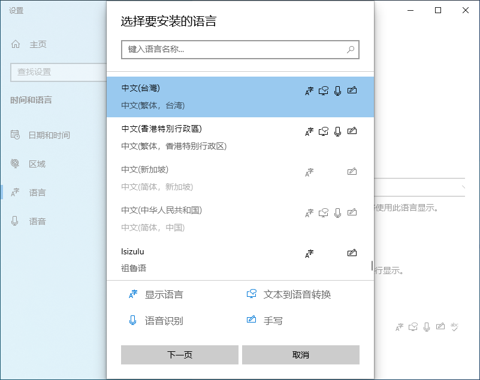
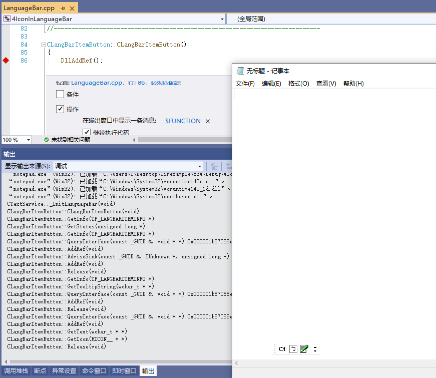
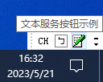

## 2.4.0 主要文件结构

- Server.cpp
- TextService.cpp
- LanguageBar.cpp

CClassFactory类厂组件的实现在Server.cpp.cpp文件中。

CTextService输入法组件的实现在TextService.cpp文件中。

CLangBarItemButton语言栏按钮组件的实现在LanguageBar.cpp文件中。

本节介绍如何将CLangBarItemButton语言栏按钮组件，装载到语言栏中。

## 2.4.1 添加系统语言

开发者的开发系统语言一般为简体中文，当输入法的运行系统语言也为简体中文时，会给调试带来相当的困扰。
从当前工程开始，输入法的运行系统语言改为繁体中文。如下图所示，为系统添加繁体中文。



## 2.4.2 显示语言栏

当前工程需要语言栏，才能看到演示效果，所以还需要开启语言栏。

完成以上步骤后，在LanguageBar.cpp文件中设置跟踪，如下图所示，可以观察到语言栏的装载过程。



## 2.4.3 添加CLangBarItemButton语言栏按钮组件

当输入法被激活后，首先获取ITfLangBarItemMgr语言栏项目管理器。

```C++
ITfLangBarItemMgr *pLangBarItemMgr;
BOOL fRet;

if (_pThreadMgr->QueryInterface(IID_ITfLangBarItemMgr, (void **)&pLangBarItemMgr) != S_OK)
	return FALSE;
```

然后创建CLangBarItemButton语言栏按钮组件，并在构造函数中初始化TF_LANGBARITEMINFO结构。

```C++
if ((_pLangBarItem = new CLangBarItemButton()) == NULL)
	goto Exit;
```

最后将CLangBarItemButton语言栏按钮组件，添加到语言栏中。

```C++
if (pLangBarItemMgr->AddItem(_pLangBarItem) != S_OK)
{
	_pLangBarItem->Release();
	_pLangBarItem = NULL;
	goto Exit;
}
```

当点击语言栏按钮时，语言栏调用CLangBarItemButton语言栏按钮组件的InitMenu(ITfMenu *pMenu)函数。
语言栏按钮组件调用ITfMenu语言栏菜单扩展，为语言栏按钮添加菜单项。

```C++
pMenu->AddMenuItem(MENUITEM_INDEX_0,
		0, 
		NULL, 
		NULL, 
		c_szMenuItemDescription0, 
		(ULONG)wcslen(c_szMenuItemDescription0), 
		NULL);
```

## 2.4.4 将语言栏项中的更改通知语言栏

在语言栏按钮组件的装载过程中，语言栏调用了语言栏按钮组件的ITfSource事件安装器，将ITfLangBarItemSink语言栏项消息接收器，安装到了语言栏按钮组件中。
当语言栏按钮组件更改了语言栏项中时，调用ITfLangBarItemSink语言栏项消息接收器，将更改通知语言栏。

当点击第一个菜单项时，语言栏按钮组件更改了按钮的提示信息，不通知语言栏该项更改。

当点击第二个菜单项时，语言栏按钮组件更改了按钮的提示信息，通知语言栏该项更改。

演示效果如下图所示：

