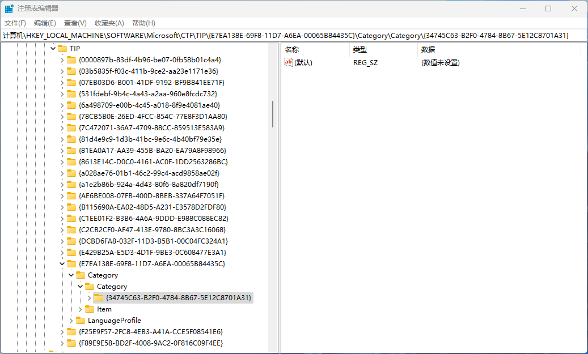

## 2.6.0 主要文件结构

- Server.cpp
  - Register.cpp
- TextService.cpp
  - KeyEventSink.cpp
   - Compartment.cpp

在Register.cpp文件中，添加了ITfCategoryMgr类别管理器的使用方法。<br/>
在KeyEventSink.cpp文件中，演示了ITfKeystrokeMgr按键管理器的调用方法。<br/>
在Compartment.cpp文件中，展示了ITfCompartment公共缓冲池的应用场景。

本节介绍如何注册输入法类别，安装键盘事件接收器。

## 2.6.1 注册输入法类别

要被TSF管理器识别为键盘文本服务，输入法的CLSID必须具有GUID_TFCAT_TIP_KEYBOARD类别值。

首先调用COM库函数CoCreateInstance，创建类别管理器组件，同时获得类别管理器接口。<br/>
然后调用ITfCategoryMgr::RegisterCategory()方法为输入法添加类别。

```C++
BOOL RegisterCategories()
{
    ITfCategoryMgr *pCategoryMgr;
    HRESULT hr;

    hr = CoCreateInstance(CLSID_TF_CategoryMgr, NULL, CLSCTX_INPROC_SERVER, 
                          IID_ITfCategoryMgr, (void**)&pCategoryMgr);

    if (hr != S_OK)
        return FALSE;

    hr = pCategoryMgr->RegisterCategory(c_clsidTextService,
                                        GUID_TFCAT_TIP_KEYBOARD, 
                                        c_clsidTextService);

    pCategoryMgr->Release();
    return (hr == S_OK);
}
```

将输入法注册为键盘文本服务后，注册表添加如下键值：



>输入法注册为键盘文本服务后，本解决方案的所有工程，在Windows 11中，也可以正常演示了。

## 2.6.2 安装键盘事件接收器

将输入法注册为键盘文本服务，只是让系统能够识别输入法，在相应过程中加载输入法。<br/>
例如，单独出现在语言栏中。

如果想要捕获键盘按键，还要像前面工程介绍的安装事件接收器那样，在激活输入法的时候，安装键盘事件接收器。

```C++
BOOL CTextService::_InitKeyEventSink()
{
    ITfKeystrokeMgr *pKeystrokeMgr;
    HRESULT hr;

    if (_pThreadMgr->QueryInterface(IID_ITfKeystrokeMgr, (void **)&pKeystrokeMgr) != S_OK)
        return FALSE;

    hr = pKeystrokeMgr->AdviseKeyEventSink(_tfClientId, (ITfKeyEventSink *)this, TRUE);

    pKeystrokeMgr->Release();

    return (hr == S_OK);
}
```

安装键盘事件接收器后，在KeyEventSink.cpp文件中的函数里设置跟踪，调试一下程序。

```C++
CTextService::_IsKeyEaten(unsigned __int64) 65
CTextService::OnTestKeyDown(ITfContext *, unsigned __int64, __int64, int *) 0
CTextService::_IsKeyEaten(unsigned __int64) 65
CTextService::OnTestKeyUp(ITfContext *, unsigned __int64, __int64, int *) 0
```

会观察到，在_IsKeyEaten()函数返回false后，TSF管理器没有继续调用输入法的按键处理函数。<br/>
这是因为输入法的键盘处理并没有处在开启状态。（可以看成现在是英文输入状态，需要切换到中文输入状态）

>只有在OnTestKeyDown、OnTestKeyUp函数返回true时，TSF管理器才会继续调用OnKeyDown、OnKeyUp函数。

## 2.6.3 注册系统保留键

系统保留键就是快捷键，是在系统一级为应用程序保留的快捷键。在输入法中，就是中英文切换，全角半角切换这样的开关。

在输入法激活的时候，获取按键管理器，调用ITfKeystrokeMgr::PreserveKey()方法，注册系统保留键。

```C++
BOOL CTextService::_InitPreservedKey()
{
    ITfKeystrokeMgr *pKeystrokeMgr;
    HRESULT hr;

    if (_pThreadMgr->QueryInterface(IID_ITfKeystrokeMgr, (void **)&pKeystrokeMgr) != S_OK)
        return FALSE;

    // register Alt+~ key
    hr = pKeystrokeMgr->PreserveKey(_tfClientId, 
                                    GUID_PRESERVEDKEY_ONOFF,
                                    &c_pkeyOnOff0,
                                    c_szPKeyOnOff,
                                    wcslen(c_szPKeyOnOff));

    // register KANJI key
    hr = pKeystrokeMgr->PreserveKey(_tfClientId, 
                                    GUID_PRESERVEDKEY_ONOFF,
                                    &c_pkeyOnOff1,
                                    c_szPKeyOnOff,
                                    wcslen(c_szPKeyOnOff));

    // register F6 key
    hr = pKeystrokeMgr->PreserveKey(_tfClientId, 
                                    GUID_PRESERVEDKEY_F6,
                                    &c_pkeyF6,
                                    c_szPKeyF6,
                                    wcslen(c_szPKeyF6));

    pKeystrokeMgr->Release();

    return (hr == S_OK);
}
```

之后，当用户按下与已注册的保留键时，TSF管理器调用ITfKeyEventSink::OnPreservedKey()方法。

```C++
STDAPI CTextService::OnPreservedKey(ITfContext *pContext, REFGUID rguid, BOOL *pfEaten)
{

    if (IsEqualGUID(rguid, GUID_PRESERVEDKEY_ONOFF))
    {
        BOOL fOpen = _IsKeyboardOpen();
        _SetKeyboardOpen(fOpen ? FALSE : TRUE);
        *pfEaten = TRUE;
    }
    else
    {
        *pfEaten = FALSE;
    }

    return S_OK;
}
```

>当前工程是日本语输入法，按Alt+~键，切换英文和日文输入状态。
>KANJI key是日本语键盘中的按键。

2.6.4 使用公共缓冲池保存键盘状态

如果输入法被停用后，再次激活时，希望恢复停用前的一些设置。这就需要将设置保存在ITfCompartment公共缓冲池中。

可以在四个级别ITfCompartment公共缓冲池：全局、线程管理器、文档管理器和上下文。

本节演示了通过读取上下文中的ITfCompartment公共缓冲池信息，得到键盘状态是否有效。

```C++
BOOL CTextService::_IsKeyboardDisabled()
{
    ITfCompartmentMgr *pCompMgr = NULL;
    ITfDocumentMgr *pDocMgrFocus = NULL;
    ITfContext *pContext = NULL;
    BOOL fDisabled = FALSE;

    if ((_pThreadMgr->GetFocus(&pDocMgrFocus) != S_OK) ||
        (pDocMgrFocus == NULL))
    {
        // if there is no focus document manager object, the keyboard 
        // is disabled.
        fDisabled = TRUE;
        goto Exit;
    }

    if ((pDocMgrFocus->GetTop(&pContext) != S_OK) ||
        (pContext == NULL))
    {
        // if there is no context object, the keyboard is disabled.
        fDisabled = TRUE;
        goto Exit;
    }

    if (pContext->QueryInterface(IID_ITfCompartmentMgr, (void **)&pCompMgr) == S_OK)
    {
        ITfCompartment *pCompartmentDisabled;
        ITfCompartment *pCompartmentEmptyContext;

        // Check GUID_COMPARTMENT_KEYBOARD_DISABLED.
        if (pCompMgr->GetCompartment(GUID_COMPARTMENT_KEYBOARD_DISABLED, &pCompartmentDisabled) == S_OK)
        {
            VARIANT var;
            if (S_OK == pCompartmentDisabled->GetValue(&var))
            {
                if (var.vt == VT_I4) // Even VT_EMPTY, GetValue() can succeed
                {
                    fDisabled = (BOOL)var.lVal;
                }
            }
            pCompartmentDisabled->Release();
        }

        // Check GUID_COMPARTMENT_EMPTYCONTEXT.
        if (pCompMgr->GetCompartment(GUID_COMPARTMENT_EMPTYCONTEXT, &pCompartmentEmptyContext) == S_OK)
        {
            VARIANT var;
            if (S_OK == pCompartmentEmptyContext->GetValue(&var))
            {
                if (var.vt == VT_I4) // Even VT_EMPTY, GetValue() can succeed
                {
                    fDisabled = (BOOL)var.lVal;
                }
            }
            pCompartmentEmptyContext->Release();
        }

        pCompMgr->Release();
    }

Exit:
    if (pContext)
        pContext->Release();

    if (pDocMgrFocus)
        pDocMgrFocus->Release();

    return fDisabled;
}
```

通过读写线程管理器中的ITfCompartment公共缓冲池信息，开关键盘状态是否开启。

```C++
BOOL CTextService::_IsKeyboardOpen()
{
    ITfCompartmentMgr *pCompMgr = NULL;
    BOOL fOpen = FALSE;

    if (_pThreadMgr->QueryInterface(IID_ITfCompartmentMgr, (void **)&pCompMgr) == S_OK)
    {
        ITfCompartment *pCompartment;
        if (pCompMgr->GetCompartment(GUID_COMPARTMENT_KEYBOARD_OPENCLOSE, &pCompartment) == S_OK)
        {
            VARIANT var;
            if (S_OK == pCompartment->GetValue(&var))
            {
                if (var.vt == VT_I4) // Even VT_EMPTY, GetValue() can succeed
                {
                    fOpen = (BOOL)var.lVal;
                }
            }
        }
        pCompMgr->Release();
    }

    return fOpen;
}
```

```C++
HRESULT CTextService::_SetKeyboardOpen(BOOL fOpen)
{
    HRESULT hr = E_FAIL;
    ITfCompartmentMgr *pCompMgr = NULL;

    if (_pThreadMgr->QueryInterface(IID_ITfCompartmentMgr, (void **)&pCompMgr) == S_OK)
    {
        ITfCompartment *pCompartment;
        if (pCompMgr->GetCompartment(GUID_COMPARTMENT_KEYBOARD_OPENCLOSE, &pCompartment) == S_OK)
        {
            VARIANT var;
            var.vt = VT_I4;
            var.lVal = fOpen;
            hr = pCompartment->SetValue(_tfClientId, &var);
        }
        pCompMgr->Release();
    }

    return hr;
}
```

>点击语言栏菜单项，可以显式看到键盘状态变化。