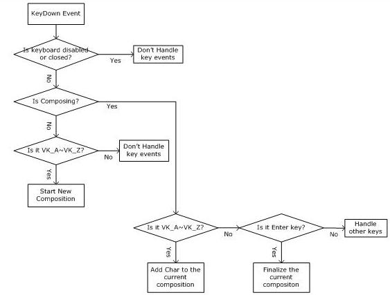

## 2.7.0 主要文件结构

- TextService.cpp
  - TextEditSink.cpp
  - KeyEventSink.cpp
- KeyHandler.cpp
- StartComposition.cpp
- EndComposition.cpp
- Composition.cpp

在TextEditSink.cpp文件中，添加了ITfTextEditSink编辑会话完成消息接收器的终止输入组合内容。<br/>
在KeyHandler.cpp文件中，实现了对按键的处理过程。<br/>
本节在StartComposition.cpp、EndComposition.cpp和Composition.cpp文件中，介绍ITfComposition输入组合的生命周期。

## 2.7.1 完整输入的处理过程

模拟一次完整的输入处理过程如下：<br/>
当用户按下编码键后，在OnTestKeyDown()函数中判断，这个按键是否需要输入法进行处理。

```C++
STDAPI CTextService::OnTestKeyDown(ITfContext *pContext, WPARAM wParam, LPARAM lParam, BOOL *pfEaten)
{
    *pfEaten = _IsKeyEaten(wParam);
    return S_OK;
}
```

当*pfEaten = TRUE时，TSF管理器调用OnKeyDown()函数。

```C++
STDAPI CTextService::OnKeyDown(ITfContext *pContext, WPARAM wParam, LPARAM lParam, BOOL *pfEaten)
{
    *pfEaten = _IsKeyEaten(wParam);

    if (*pfEaten)
    {
        _InvokeKeyHandler(pContext, wParam, lParam);
    }
    return S_OK;
}
```

输入法在_InvokeKeyHandler()函数中，请求一场ITfEditSession编辑会话。

```C++
HRESULT CTextService::_InvokeKeyHandler(ITfContext *pContext, WPARAM wParam, LPARAM lParam)
{
    CKeyHandlerEditSession *pEditSession;
    HRESULT hr = E_FAIL;

    // we'll insert a char ourselves in place of this keystroke
    if ((pEditSession = new CKeyHandlerEditSession(this, pContext, wParam)) == NULL)
        goto Exit;

    // A lock is required
    // nb: this method is one of the few places where it is legal to use
    // the TF_ES_SYNC flag
    hr = pContext->RequestEditSession(_tfClientId, pEditSession, TF_ES_SYNC | TF_ES_READWRITE, &hr);

    pEditSession->Release();

Exit:
    return hr;
}
```

TSF管理器调用ITfEditSession编辑会话接口，执行相应的处理过程。

```C++
STDAPI CKeyHandlerEditSession::DoEditSession(TfEditCookie ec)
{
    switch (_wParam)
    {
        case VK_LEFT:
        case VK_RIGHT:
            return _pTextService->_HandleArrowKey(ec, _pContext, _wParam);

        case VK_RETURN:
            return _pTextService->_HandleReturnKey(ec, _pContext);

        default:
            if (_wParam >= 'A' && _wParam <= 'Z')
                return _pTextService->_HandleCharacterKey(ec, _pContext, _wParam);
            break;
    }

    return S_OK;

}
```

重复以上步骤，直到用户按下回车键时，调用_TerminateComposition()函数，终止ITfComposition输入组合。

```C++
HRESULT CTextService::_HandleReturnKey(TfEditCookie ec, ITfContext *pContext)
{
    // just terminate the composition
    _TerminateComposition(ec);
    return S_OK;
}
```

下图是原文档中描述这一过程的流程图。



>与简体中文输入法不同，日本语输入法，繁体中文输入法与早期的微软拼音和智能ABC输入法，都是按回车键将候选字上屏。

## 2.7.2 输入组合的生命周期

>输入法并不直接将汉字发送给应用程序。而是通过一系列步骤，完成输入。<br/>
在空间上，输入法通过ITfInsertAtSelection在选定位置插入内容获得ITfRange文本范围，将ITfRange文本范围保存到TF_SELECTION文本选定数据中，然后将TF_SELECTION文本选定数据设置到ITfContext上下文中。<br/>
在时间上，输入法从ITfContext上下文中获得ITfContextComposition上下文输入组合，在ITfContextComposition上下文输入组合中，创建ITfComposition输入组合。<br/>
在ITfComposition输入组合生命周期中，操作ITfRange文本范围，实现汉字的输入。

### 2.7.2.1 输入组合的创建

当用户每回首次按下编码键时，将创建ITfComposition输入组合。

```C++
STDAPI CStartCompositionEditSession::DoEditSession(TfEditCookie ec)
{
    ITfInsertAtSelection *pInsertAtSelection = NULL;
    ITfRange *pRangeInsert = NULL;
    ITfContextComposition *pContextComposition = NULL;
    ITfComposition *pComposition = NULL;
    HRESULT hr = E_FAIL;
//获取ITfInsertAtSelection在选定位置插入内容接口
    // A special interface is required to insert text at the selection
    if (_pContext->QueryInterface(IID_ITfInsertAtSelection, (void **)&pInsertAtSelection) != S_OK)
    {
        goto Exit;
    }
//通过插入一个空字符，获得ITfRange文本范围
    // insert the text
    if (pInsertAtSelection->InsertTextAtSelection(ec, TF_IAS_QUERYONLY, NULL, 0, &pRangeInsert) != S_OK)
    {
        goto Exit;
    }
//从上下文中获取一个ITfContextComposition上下文输入组合对象
    // get an interface on the context to deal with compositions
    if (_pContext->QueryInterface(IID_ITfContextComposition, (void **)&pContextComposition) != S_OK)
    {
        goto Exit;
    }
//创建新的输入组合
    // start the new composition
    if ((pContextComposition->StartComposition(ec, pRangeInsert, _pTextService, &pComposition) == S_OK) && (pComposition != NULL))
    {//保存当前输入组合对象，输入法处于编码合成状态
        // Store the pointer of this new composition object in the instance 
        // of the CTextService class. So this instance of the CTextService 
        // class can know now it is in the composition stage.
        _pTextService->_SetComposition(pComposition);

        // 
        //  set selection to the adjusted range
        // 将当前输入组合状态设置到上下文中
        TF_SELECTION tfSelection;
        tfSelection.range = pRangeInsert;
        tfSelection.style.ase = TF_AE_NONE;
        tfSelection.style.fInterimChar = FALSE;
        _pContext->SetSelection(ec, 1, &tfSelection);
    }

Exit:
    if (pContextComposition != NULL)
        pContextComposition->Release();

    if (pRangeInsert != NULL)
        pRangeInsert->Release();

    if (pInsertAtSelection != NULL)
        pInsertAtSelection->Release();

    return S_OK;
}
```

## 2.7.3 输入组合的意外终止