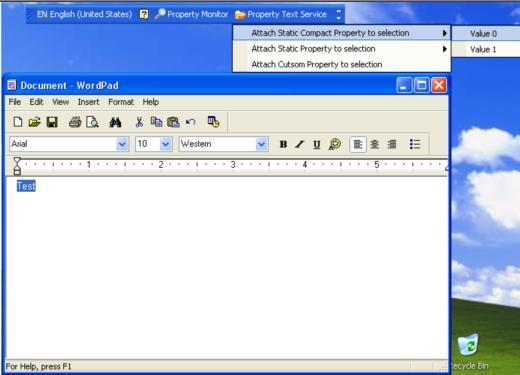
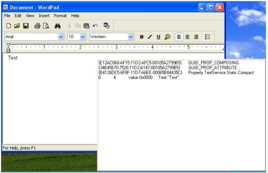

## 2.B.0 主要文件结构

- TextService.cpp
  - LanguageBar.cpp
    - StaticCompactProperty.cpp
    - StaticProperty.cpp
    - CustomProperty.cpp
-CustomPropertyStore.cpp

在Register.cpp文件中，增加了将自定义属性的GUID添加到注册表输入法预定义属性类别操作。<br/>
在StaticCompactProperty.cpp、StaticProperty.cpp、CustomProperty.cpp文件中，演示了如何将属性附加到文本范围。<br/>
在CustomPropertyStore.cpp文件中，演示了如何实现一个属性对象。<br/>

本节介绍如何将自定义属性附加到选择的文本范围，本节未演示ITfCreatePropertyStore创建属性存储接口。

## 2.B.1 将属性附加到文本范围

本节输入法需要在win7或win8系统中演示。

请将项目-属性-调试-命令，设置为使用写字板进行调试。

>$(ProgramW6432)\Windows NT\Accessories\wordpad.exe

GUID_TFCAT_PROPSTYLE_STATICCOMPACT和GUID_TFCAT_PROPSTYLE_STATIC属性的演示过程相同。
用微软拼音输入任意汉字，然后用鼠标选中汉字，在语言栏选择"Attach Static Compact Property to selection"或"Attach Static Property to selection"的子菜单项。



然后就可以在上一节的属性监视窗口中观察到属性被附加到了选择的文本范围。



## 2.B.2 将自定义属性附加到文本范围

与静态属性不同，当在语言栏选择"Attach Cutsom Property to selection"菜单项时，输入法创建了一个ITfPropertyStore属性存储对象。
然后调用pProperty->SetValueStore()方法，使用属性存储对象设置文本范围的属性值。

```C++
STDAPI CCustomPropertyEditSession::DoEditSession(TfEditCookie ec)
{
    ITfProperty *pProperty;
    TF_SELECTION tfSelection;
    ULONG cFetched;

    if (_pContext->GetSelection(ec, TF_DEFAULT_SELECTION, 1, &tfSelection, &cFetched) != S_OK || cFetched != 1)
        return S_FALSE;

    if (_pContext->GetProperty(c_guidPropCustom, &pProperty) == S_OK)
    {
        CCustomPropertyStore *pCustomPropertyStore = new CCustomPropertyStore();
        if (pCustomPropertyStore != NULL)
            pProperty->SetValueStore(ec, tfSelection.range, pCustomPropertyStore);
        pProperty->Release();
    }

    tfSelection.range->Release();
    return S_OK;
}
```

在2.A.4小节的样例中，当客户端调用pprop->GetValue()方法获取属性值时，TSF管理器调用本节的ITfPropertyStore::GetData()方法，动态获取属性值。

## 2.B.3 小结

至此，微软早期的一个TSF输入法样例已全部介绍完毕。该样例官方链接已失效，读者如果想要获取原版样例，可以尝试在GitHub中，使用这些样例中的GUID进行搜索。<br/>
不过，作者并没有改动多少源码，而且在doc目录中保存了原文档。<br/>
该样例十分珍贵，至少对于作者而言是如此。

早期，作者的水平不高，写ime输入法都是磕磕绊绊。TSF推出的时候，直接让作者放弃了。当时以为，这辈子学不会写输入法了。<br/>
其实，这份源码，我原先也看过，实在搞不懂，这些都是干什么的。直到这次，我发现有文档，尝试的看了看，竟然发现，我看得懂英文了。<br/>
不过，离写代码，还应该有很大距离。后面打算继续看微软拼音、启程和中州韵的源码，也有可能看谷歌拼音。

终于，可以开始了。